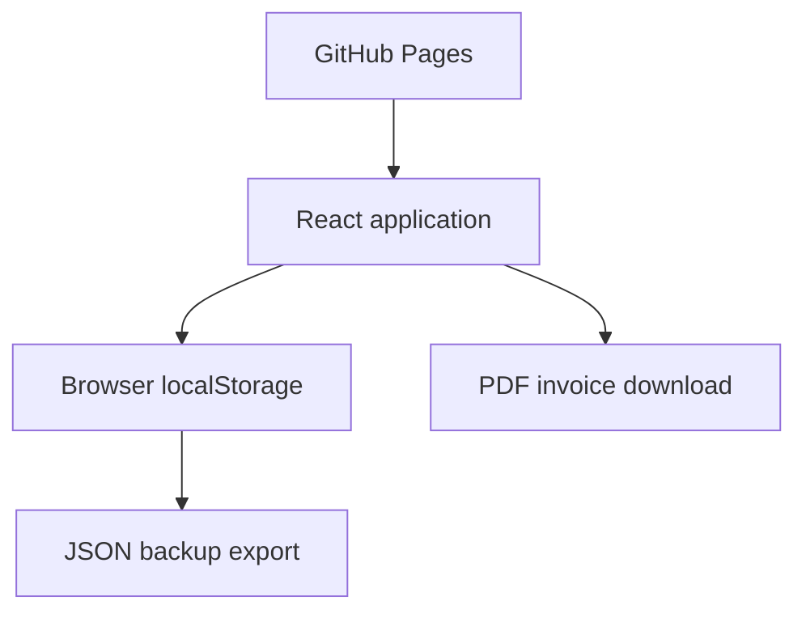

# Freelance IT Ops Console

A private, browser-first workspace for capturing freelance tasks, tracking time, and generating professional PDF invoices. The application is designed to run as a static site on GitHub Pages: no local server, database, account, or third-party integration is required.

> Data is stored only in the current browser profile. Export a JSON backup regularly and before clearing browser data or changing devices.

## What it does

- Captures tasks manually and moves them through Inbox, Today, Active, Completed, and Invoiced states.
- Runs one persistent task timer that remains accurate after refreshing or closing the tab.
- Reviews and adjusts billable time before invoicing.
- Generates downloadable, Unicode-capable PDF invoices entirely in the browser.
- Stores immutable invoice snapshots for repeat downloads.
- Exports and imports complete JSON backups.
- Works responsively on desktop and mobile browsers.

## Online architecture



GitHub Pages serves only the compiled frontend. All task, timer, settings, and invoice operations happen locally in the browser. The legacy `backend/` directory is retained for reference but is not used by the online edition.

## Run locally

Requirements: Node.js 24+ and npm.

```bash
cd frontend
npm ci
npm run dev
```

Quality checks:

```bash
npm run lint
npm test
npm run build
```

## Deploy to GitHub Pages for free

The compiled site is stored in the dedicated `gh-pages` branch. It includes a `.nojekyll` file, so GitHub can publish the static files directly without a custom GitHub Actions workflow.

1. Open the repository **Settings → Pages**.
2. Under **Build and deployment**, choose **Deploy from a branch**.
3. Select the `gh-pages` branch and `/ (root)`, then save.

The site will be available at `https://romanmamrukov.github.io/freemgsys/`. The Vite base path and hash-based routing are already configured for this address.

Using tasks, timers, backups, and invoices online never requires Node.js or a local machine. Node.js is needed only when a developer changes the application source and produces a new release build.

## Data and privacy

- No analytics, accounts, cookies, external APIs, or automatic integrations.
- Clearing site data removes the local workspace.
- A JSON backup contains business and invoice information in plain text; store it securely.
- PDFs are generated on-device and downloaded through the browser.

## Technology

React 19 · Vite 8 · React Router · jsPDF · Vitest · ESLint · GitHub Pages

## License

No license has been declared yet. Add one before accepting external contributions or reuse.
